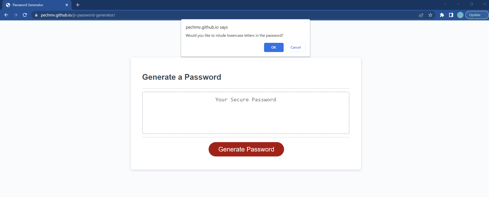

# JavaScript Random Password Generator

## Description

This week's challenge was to use JavaScript to create a random password generator. This challenge has helped me learn how to use the basics of JavaScript like adding functions and loops with arrays. Adding in window prompts to help the user find the specific character types and length for their password.

## Usage

Click on "Generate Password" button then a window prompt will pop up. The question is about the length of the password. If the user answers a number that is lower than 8 and higher than 128, the window will tell the user the password length must be between 8 and 128 characters. If the user answers with a different character, the window will ask the user to try again. When the user answers within the criteria, the window prompts will continue to pop up with questions about what the user wants to include in their passwords. After answering the prompts, the window will then generate random characters for the user. 

## Links

My GitHub Repository: (https://github.com/PechMV/js-password-generator)

Deployed URL for Web Application: (https://pechmv.github.io/js-password-generator/)

## Changes Made

* Added function for randomized characters
* Added var window comfirm for window prompts
* Added character lists
* Added if statements